# HTTP 状态码

* [1xx 消息](#1xx-消息)
  * [100 Continue](#100-continue)
  * [101 Switching Protocols](#101-switching-protocols)
* [2xx 成功](#2xx-成功)
  * [200 OK](#200-ok)
  * [201 Created](#201-created)
  * [202 Accepted](#202-accepted)
  * [204 No Content](#204-no-content)
  * [206 Partial Content](#206-partial-content)
  * [207 Multi-Status](#207-multi-status)
* [3xx 重定向](#3xx-重定向)
  * [300 Multiple Choices](#300-multiple-choices)
  * [301 Moved Permanently](#301-moved-permanently)
  * [302 Found](#302-found)
  * [303 See Other](#303-see-other)
  * [304 Not Modified](#304-not-modified)
  * [305 Use Proxy](#305-use-proxy)
  * [307 Temporary Redirect](#307-temporary-redirect)
* [4xx 客户端错误](#4xx-客户端错误)
  * [400 Bad Request](#400-bad-request)
  * [401 Unauthorized](#401-unauthorized)
  * [402 Payment Required](#402-payment-required)
  * [403 Forbidden](#403-forbidden)
  * [404 Not Found](#404-not-found)
  * [405 Method Not Allowed](#405-method-not-allowed)
  * [406 Not Acceptable](#406-not-acceptable)
  * [408 Request Timeout](#408-request-timeout)
  * [409 Conflict](#409-conflict)
  * [410 Gone](#410-gone)
  * [411 Length Required](#411-length-required)
  * [412 Precondition Failed](#412-precondition-failed)
  * [413 Request Entity Too Large](#413-request-entity-too-large)
  * [414 Request-URI Too Long](#414-request-uri-too-long)
  * [415 Unsupported Media Type](#415-unsupported-media-type)
  * [416 Requested Range Not Satisfiable](#416-requested-range-not-satisfiable)
  * [417 Expectation Failed](#417-expectation-failed)
  * [418 I'm a teapot](#418-im-a-teapot)
  * [421 Misdirected Request](#421-misdirected-request)
  * [422 Unprocessable Entity](#422-unprocessable-entity)
  * [423 Locked](#423-locked)
  * [424 Failed Dependency](#424-failed-dependency)
  * [425 Too Early](#425-too-early)
  * [426 Upgrade Required](#426-upgrade-required)
  * [429 Too Many Requests](#429-too-many-requests)
  * [431 Request Header Fields Too Large](#431-request-header-fields-too-large)
  * [451 Unavailable For Legal Reasons](#451-unavailable-for-legal-reasons)
* [5xx 服务器错误](#5xx-服务器错误)
  * [500 Internal Server Error](#500-internal-server-error)
  * [501 Not Implemented](#501-not-implemented)
  * [502 Bad Gateway](#502-bad-gateway)
  * [503 Service Unavailable](#503-service-unavailable)
  * [504 Gateway Timeout](#504-gateway-timeout)
  * [506 Variant Also Negotiates](#506-variant-also-negotiates)
  * [507 Insufficient Storage](#507-insufficient-storage)
  * [508 Loop Detected](#508-loop-detected)
  * [510 Not Extended](#510-not-extended)
  * [511 Network Authentication Required](#511-network-authentication-required)

## 1xx 消息

> 这一类型的状态码，代表请求已被接受，需要继续处理。这类响应是临时响应，只包含状态行和某些可选的响应头信息，并以空行结束。这些状态码代表的响应都是信息性的，标识客户应该采取的其他行动。

### 100 Continue

> 服务器已经接收到请求头，并且客户端应继续发送请求主体，或者如果请求已经完成，忽略这个响应。服务器必须在请求完成后向客户端发送一个最终响应。

### 101 Switching Protocols

> 服务器已经理解了客户端的请求，并将通过消息头通知客户端采用不同的协议来完成这个请求。在发送完这个响应最后的空行后，服务器将会切换到在消息头中定义的那些协议。只有在切换新的协议更有好处的时候才应该采取类似措施，例如，切换到新的 HTTP/2 版本比旧版本更有优势，或者切换到一个实时且同步的协议以传送利用此类特性的资源。

## 2xx 成功

> 这一类型的状态码，代表请求已成功被服务器接收、理解、并接受。

### 200 OK

> 请求已成功，请求所希望的响应头或数据体将随此响应返回。实际的响应将取决于所使用的请求方法。在 GET 请求中，响应将包含与请求的资源相对应的实体。在 POST 请求中，响应将包含描述或操作结果的实体。

### 201 Created

> 请求已经被实现，而且有一个新的资源已经依据请求的需要而创建，且其 URI 已经随头信息返回。

### 202 Accepted

> 服务器已接受请求，但尚未处理。最终该请求可能会也可能不会被执行，并且可能在处理发生时被禁止。

### 204 No Content

> 服务器成功处理了请求，没有返回任何内容。

### 206 Partial Content

> 服务器已经成功处理了部分 GET 请求。类似于迅雷这类的 HTTP 下载工具都是使用此类响应实现断点续传或者将一个大文档分解为多个下载段同时下载。

### 207 Multi-Status

> 代表之后的消息体将是一个 XML 消息，并且可能依照之前子请求数量的不同，包含一系列独立的响应代码。

## 3xx 重定向

> 这类状态码代表需要客户端采取进一步的操作才能完成请求。通常，这些状态码用来重定向，后续的请求地址在本次响应的头信息中指明。当且仅当后续的请求所使用的方法是 GET 或者 HEAD 时，用户浏览器才可以在没有用户介入的情况下自动提交所需要的后续请求。

### 300 Multiple Choices

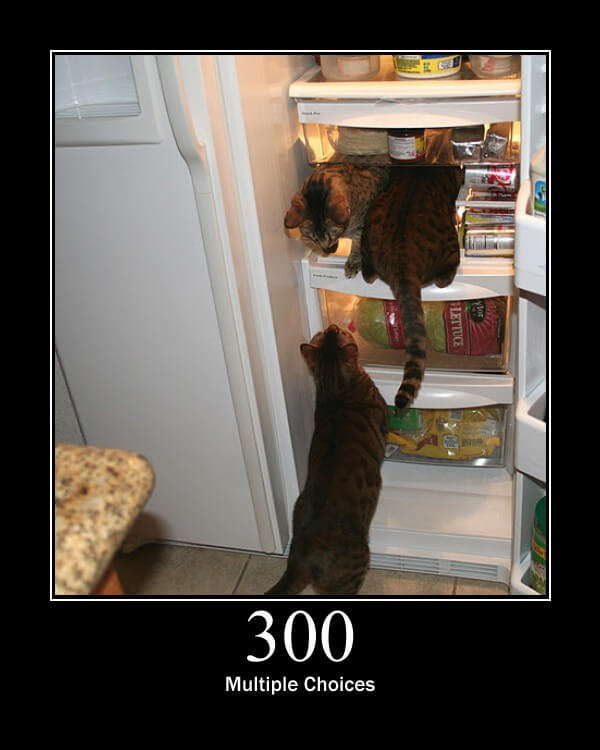

> 被请求的资源有一系列可供选择的回馈信息，每个都有自己特定的地址和浏览器驱动的商议信息。用户或浏览器能够自行选择一个首选的地址进行重定向。除非这是一个 HEAD 请求，否则该响应应当包括一个资源特性及地址的列表的实体，以便用户或浏览器从中选择最合适的重定向地址。

### 301 Moved Permanently

> 被请求的资源已永久移动到新位置，并且将来任何对此资源的引用都应该使用本响应返回的若干个 URI 之一。如果可能，拥有链接编辑功能的客户端应当自动把请求的地址修改为从服务器反馈回来的地址。除非额外指定，否则这个响应也是可缓存的。如果这不是一个 GET 或者 HEAD 请求，那么浏览器禁止自动进行重定向，除非得到用户的确认，因为请求的条件可能因此发生变化。

### 302 Found

> 要求客户端执行临时重定向。由于这样的重定向是临时的，客户端应当继续向原有地址发送以后的请求。如果这不是一个 GET 或者 HEAD 请求，那么浏览器禁止自动进行重定向，除非得到用户的确认，因为请求的条件可能因此发生变化。

### 303 See Other

> 对应当前请求的响应可以在另一个 URI 上被找到，当响应于 POST / PUT / DELETE 接收到响应时，客户端应该假定服务器已经收到数据，并且应该使用单独的 GET 消息发出重定向。这个方法的存在主要是为了允许由脚本激活的 POST 请求输出重定向到一个新的资源。这个新的 URI 不是原始资源的替代引用。同时，303 响应禁止被缓存。当然，重定向请求可能被缓存。

### 304 Not Modified

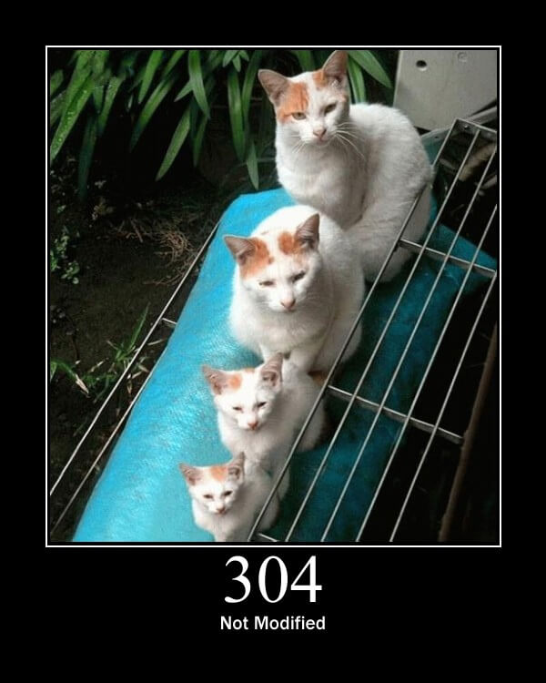

> 表示资源在由请求头中参数指定的某一版本之后，未曾被修改。在这种情况下，由于客户端仍然具有以前下载的副本，因此不需要重新传输资源。

### 305 Use Proxy

> 被请求的资源必须通过指定的代理才能被访问。

### 307 Temporary Redirect

> 在这种情况下，请求应该与另一个 URI 重复，但后续的请求应仍使用原始的 URI 。与 302 相反，当重新发出原始请求时，不允许更改请求方法。例如，应该使用另一个 POST 请求来重复 POST 请求。

## 4xx 客户端错误

> 这类的状态码代表了客户端看起来可能发生了错误，妨碍了服务器的处理。除非响应的是一个 HEAD 请求，否则服务器就应该返回一个解释当前错误状况的实体，以及这是临时的还是永久性的状况。这些状态码适用于任何请求方法。浏览器应当向用户显示任何包含在此类错误响应中的实体内容。

### 400 Bad Request

> 由于明显的客户端错误，例如，格式错误的请求语法，太大的大小，无效的请求消息或欺骗性路由请求，服务器不能或不会处理该请求。

### 401 Unauthorized

> 请求要求用户的身份认证。

### 402 Payment Required

> 该状态码是为了将来可能的需求而预留的。该状态码最初的意图可能被用作某种形式的数字现金或在线支付方案的一部分，但几乎没有哪家服务商使用，而且这个状态码通常不被使用。

### 403 Forbidden

> 服务器理解请求客户端的请求，但是拒绝执行此请求。

### 404 Not Found

> 服务器无法根据客户端的请求找到资源。

### 405 Method Not Allowed

> 客户端请求中的方法被禁止。

### 406 Not Acceptable

> 服务器无法根据客户端请求的内容特性完成请求。

### 408 Request Timeout

> 请求超时，根据 HTTP 规范，客户端没有在服务器预备等待的时间内完成一个请求的发送，客户端可以随时再次提交这一请求而无需进行任何更改。

### 409 Conflict

> 表示因为请求存在冲突无法处理该请求，例如多个同步更新之间的编辑冲突。

### 410 Gone

> 表示所请求的资源将不再可用，当资源被有意地删除并且资源应被清除时，应该使用这个。

### 411 Length Required

> 服务器拒绝在没有定义 Content-Length 头的情况下接受请求，在添加了表明请求消息体长度的有效 Content-Length 头之后，客户端可以再次提交该请求。

### 412 Precondition Failed

> 

### 413 Request Entity Too Large

### 414 Request-URI Too Long

### 415 Unsupported Media Type

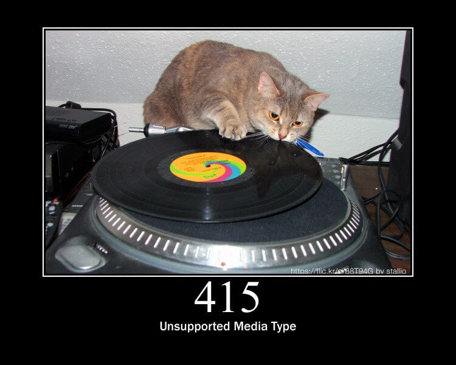

### 416 Requested Range Not Satisfiable

### 417 Expectation Failed

### 418 I'm a teapot

### 421 Misdirected Request

### 422 Unprocessable Entity

### 423 Locked

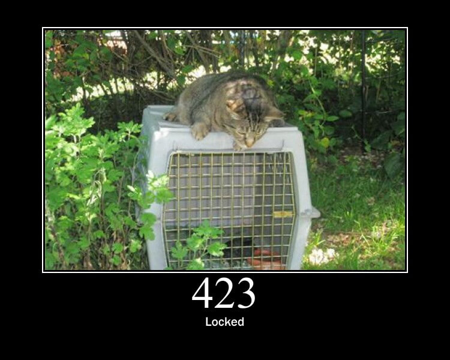

### 424 Failed Dependency

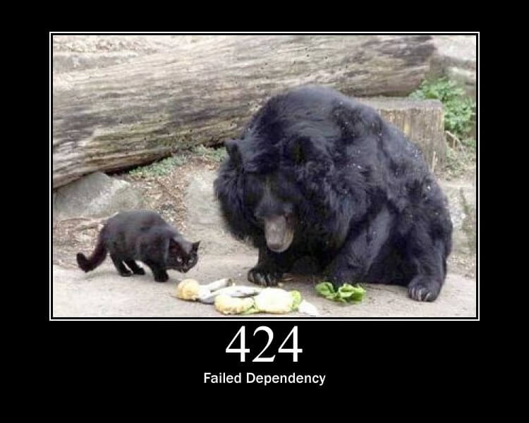

### 425 Too Early

### 426 Upgrade Required

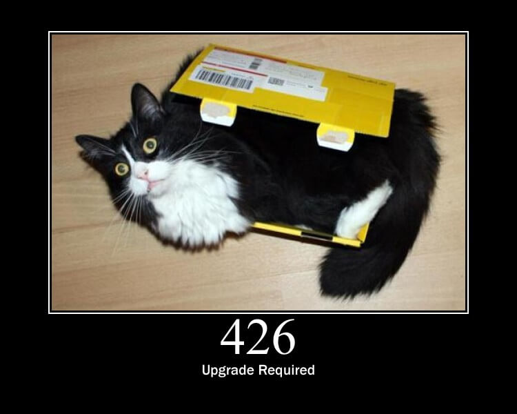

### 429 Too Many Requests

### 431 Request Header Fields Too Large

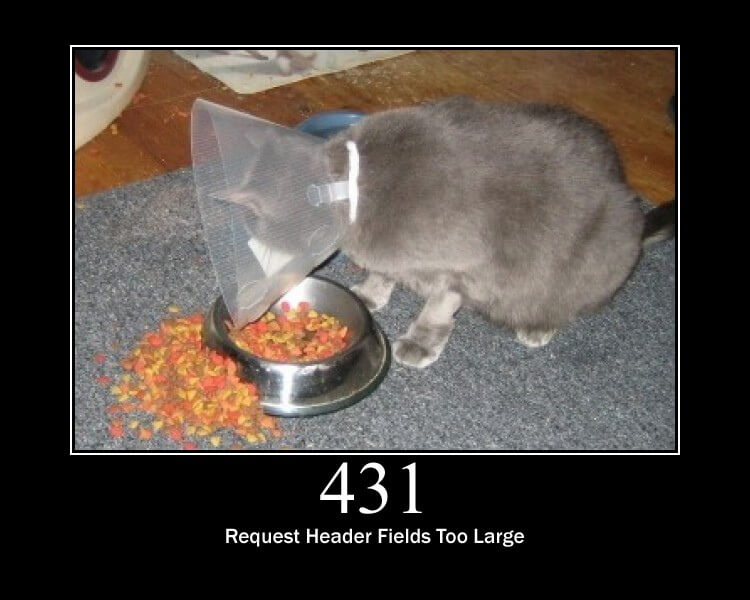

### 451 Unavailable For Legal Reasons

## 5xx 服务器错误

### 500 Internal Server Error

### 501 Not Implemented

### 502 Bad Gateway

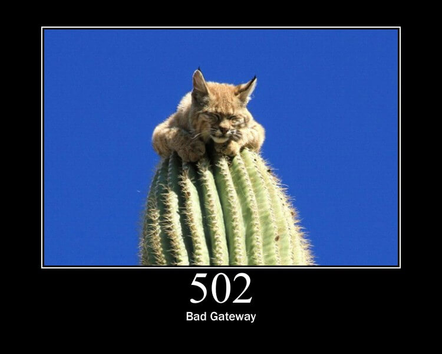

### 503 Service Unavailable

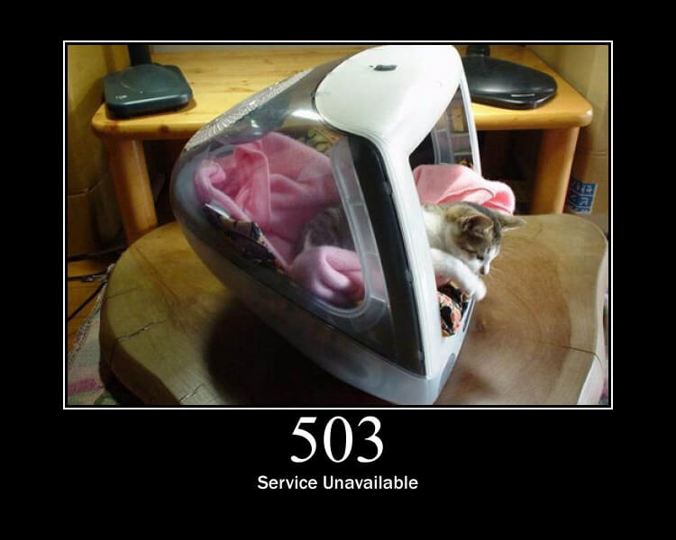

### 504 Gateway Timeout

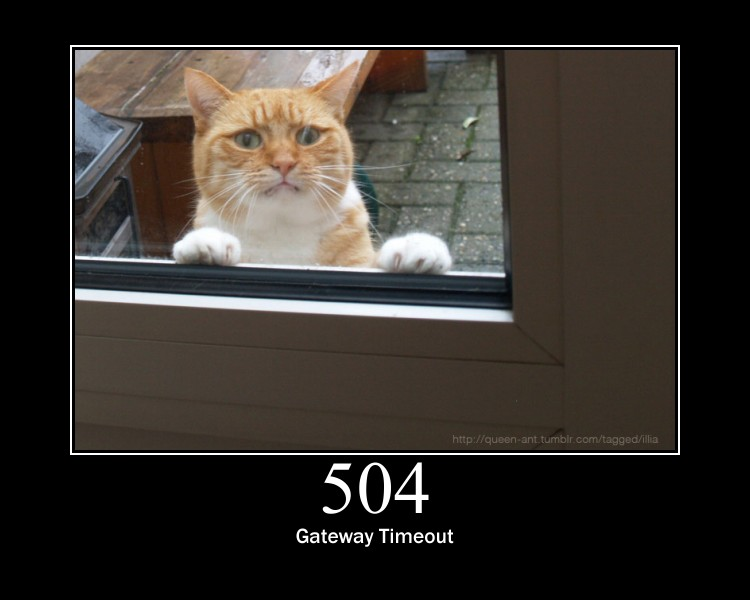

### 506 Variant Also Negotiates

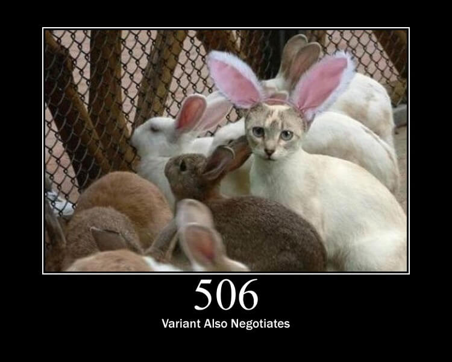

### 507 Insufficient Storage

### 508 Loop Detected

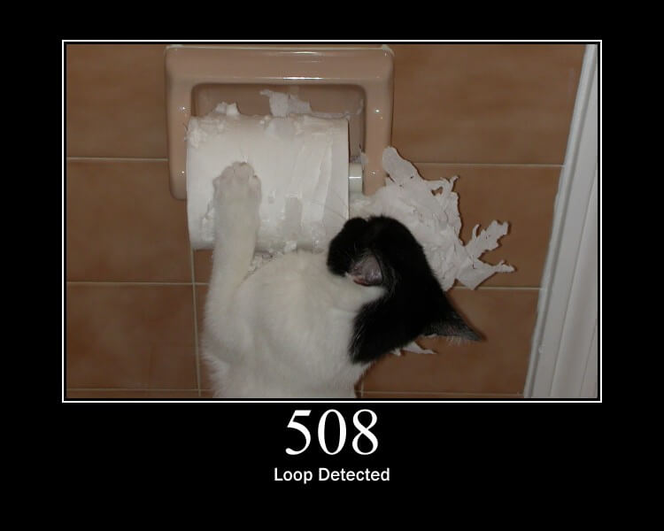

### 510 Not Extended

### 511 Network Authentication Required

