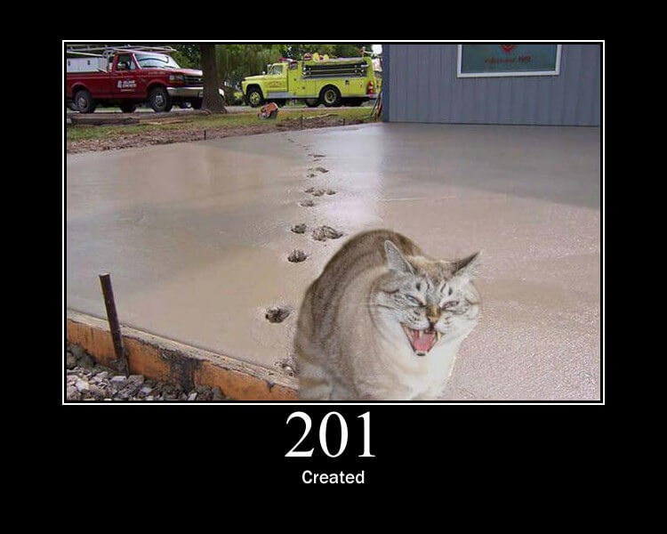
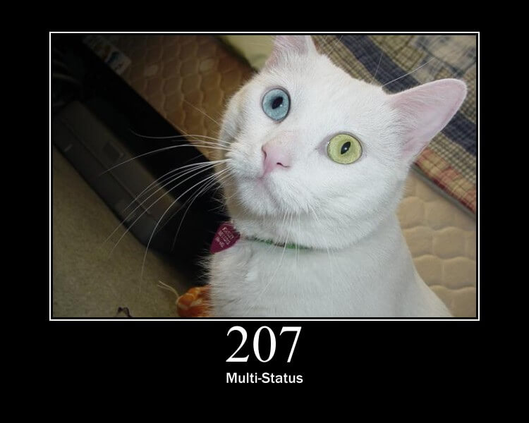
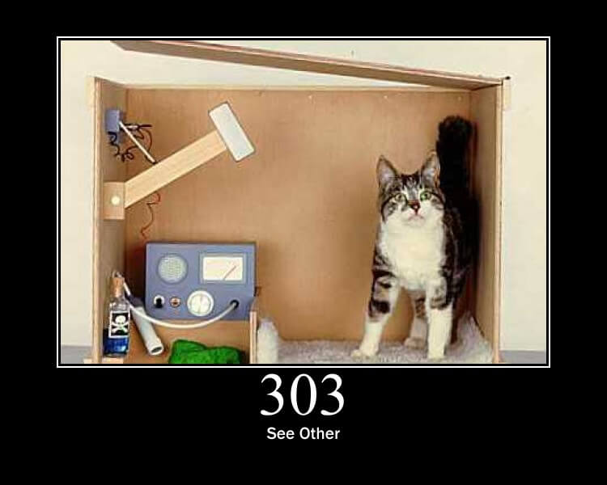
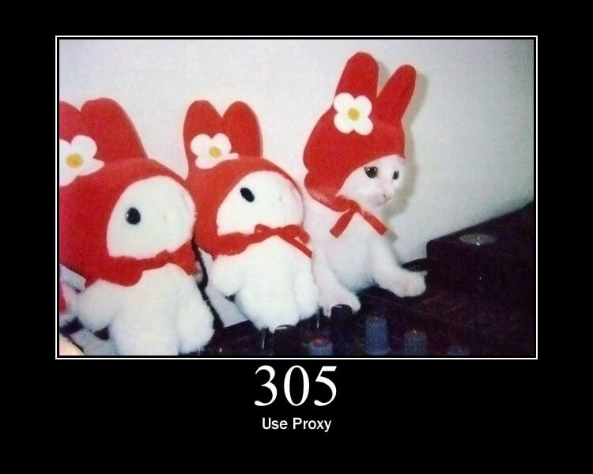

# HTTP 状态码

* [1xx 信息 - 服务器收到请求，需要请求者继续执行操作](#1xx-信息)
  * [100 Continue - 继续](#100-continue)
  * [101 Switching Protocols - 切换协议](#101-switching-protocols)
* [2xx 成功 - 操作被成功接收并处理](#2xx-成功)
  * [200 OK - 请求成功](#200-ok)
  * [201 Created - 已创建](#201-created)
  * [202 Accepted - 已接受](#202-accepted)
  * [204 No Content - 无内容](#204-no-content)
  * [206 Partial Content - 部分内容](#206-partial-content)
  * [207 Multi-Status - 多种状态](#207-multi-status)
* [3xx 重定向 - 需要进一步的操作以完成请求](#3xx-重定向)
  * [300 Multiple Choices - 多种选择](#300-multiple-choices)
  * [301 Moved Permanently - 永久移动](#301-moved-permanently)
  * [302 Found - 临时移动](#302-found)
  * [303 See Other - 查看其它地址](#303-see-other)
  * [304 Not Modified - 未修改](#304-not-modified)
  * [305 Use Proxy - 使用代理](#305-use-proxy)
  * [307 Temporary Redirect - 临时重定向](#307-temporary-redirect)
* [4xx 客户端错误 - 请求包含语法错误或无法完成请求](#4xx-客户端错误)
* [5xx 服务器错误 - 服务器在处理请求的过程中发生了错误](#5xx-服务器错误)

## 1xx 信息

### 100 Continue

> 继续：客户端应继续其请求。

### 101 Switching Protocols

> 切换协议：服务器根据客户端的请求切换协议。只能切换到更高级的协议，例如，切换到 HTTP 的新版本协议。

## 2xx 成功

### 200 OK

> 请求成功：一般用于 GET 与 POST 请求。

### 201 Created

> 已创建：成功请求并创建了新的资源。

### 202 Accepted

> 已接受：已经接受请求，但未处理完成。

### 204 No Content

> 无内容：服务器成功处理，但未返回内容。在未更新网页的情况下，可确保浏览器继续显示当前文档。

### 206 Partial Content

> 部分内容：服务器成功处理了部分 GET 请求。

### 207 Multi-Status

> 多种状态：代表之后的消息体将是一个 XML 消息，并且可能依照之前子请求数量的不同，包含一系列独立的响应代码。

## 3xx 重定向

### 300 Multiple Choices

> 多种选择：请求的资源可包括多个位置，相应可返回一个资源特征与地址的列表用于用户终端选择。

### 301 Moved Permanently

> 永久移动：请求的资源已被永久的移动到新的 URI ，返回信息会包括新的 URI ，浏览器会自动定向到新的 URI 。今后任何新的请求都应使用新的 URI 代替。

### 302 Found

> 临时移动：与 301 类似。但资源只是临时被移动。客户端应继续使用原有 URI 。

### 303 See Other

> 查看其它地址：与 301 类似。使用 GET 和 POST 请求查看。

### 304 Not Modified

> 未修改：所请求的资源未修改，服务器返回此状态码时，不会返回任何资源。客户端通常会缓存访问过的资源，通过提供一个头信息指出客户端希望只返回在指定日期之后修改的资源。

### 305 Use Proxy

> 使用代理：所请求的资源必须通过代理访问。

### 307 Temporary Redirect

> 临时重定向：与 302 类似。使用 GET 请求重定向。

## 4xx 客户端错误

## 5xx 服务器错误